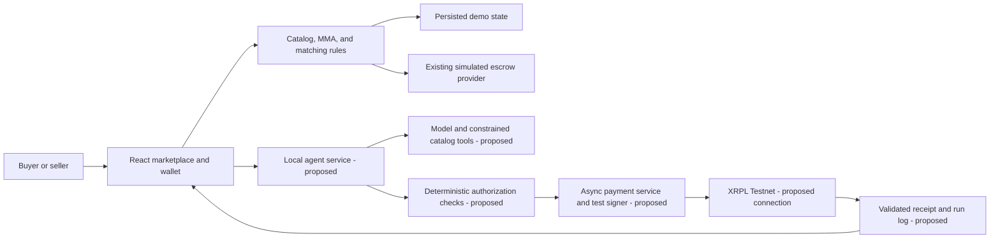

# Yardle holistic evaluation and pitch roadmap

Date: 2026-09-05. Updated against the user's final-submission checklist, local CHALLENGE.md, CONTEXT.md, and repository snapshot during active implementation. This is a product and rubric assessment, not verification of the coding AI's unfinished work. The user's newer checklist governs the minimum deliverables assessed here. PLANNING.md is unchanged. Official XRPL documentation was checked for payment validation and escrow constraints; resources.md was not available locally.

## Verdict

Yardle has a coherent product demonstration: buyers express demand and spending limits, sellers receive a reference valuation, rules reject outliers, and eligible transactions advance through a visible wallet lifecycle. It is a credible prototype direction for reducing repeated search and price uncertainty in second-hand commerce.

The simulation-only scope does not meet the newer final-submission checklist: it still needs at least one successful XRPL transaction, a demonstrated agentic transaction flow, transaction evidence, and a submission architecture/reproduction package. Declaring xrpl as a dependency, running deterministic checks, and updating simulated balances do not supply those missing demonstrations.

Requirement correction: CHALLENGE.md uses stronger language about the Starter Kit, x402, and MPP, but the newer user-provided checklist calls the Starter Kit recommended and requests payment-standard explanations if applicable. For this evaluation, do not treat either framework or both payment standards as unconditional submission blockers. Actual AI-agent value and an agentic transaction flow still need to be demonstrated. Framework/protocol use can strengthen the original weighted rubric even when optional under the submission checklist. A future-features slide explains missing work but does not demonstrate it.

The strongest pitch is demand-led resale with bounded purchasing authority and explainable price protection. Avoid making bot elimination or autonomous AI the central demonstrated claim until there is corresponding evidence.

## Rubric assessment

Ratings describe evidence strength if the planned demo is completed; they are not numerical score predictions or verified feature status.

| Criterion | Weight | Assessment | Evidence needed to strengthen it |
| --- | --- | --- | --- |
| Reachability | 20% | Partial. Familiar resale use case and several product categories support the adoption story. A local catalog and single-browser personas do not establish interoperability, scale, or operational readiness. | Choose an initial customer segment; show how a buyer gets value and how sellers are acquired. Describe onboarding, data coverage, wallet friction, and a realistic expansion path. |
| Creativity | 20% | Partial, with a major integration gap. I Need plus bounded budgets and deterministic allocation make a distinctive workflow. Price bands alone are conventional rules; the rubric specifically rewards AI-native use of the Starter Kit and x402. | Demonstrate an agent obtaining missing valuation evidence, applying a spending policy, and using paid data in an actual decision. Explain the advantage over alerts and manual checkout. |
| Feasibility | 20% | Partial. Seeded valuations and a local state machine are practical for a repeatable demo. Production viability remains unproven across data quality, delivery disputes, user authorization, and acquisition costs. | Show boundary/failure tests and reconciled balances. Present a cost model and explicit ownership of payment/dispute operations; distinguish estimates from measurements. |
| Technical Depth | 20% | Largest weakness. Sound domain logic, tests, idempotency, and accounting are useful engineering, but cannot substitute for XRPL/x402/agent integrations named in this criterion. | A real verifiable payment lifecycle, transaction evidence, an actual bounded agent action, and protocol integration evidence. |
| User Experience & Design | 10% | Best opportunity in the current scope, conditional on browser verification. Valuation provenance, visible decisions, wallet history, and clear progress can make the commercial story understandable. | A repeatable flow showing approval, rejection, insufficient funds, refund, and completion. Clearly label simulated payments and avoid fabricated chain confirmations. |
| Builder Feedback | 10% | Unverified. No feedback evidence was identified among the reviewed project files. Lack of evidence here does not prove the hook is absent elsewhere. | Verify the required feedback hook and challenge skills. Capture authentic setup issues, SDK/protocol friction, reproduction steps, workarounds, and mainnet-readiness questions based on actual attempts. |

The four 20% criteria account for 80% of judging weight. Visual polish is valuable, but most marks are not allocated to appearance. Do not treat adding more screens as a substitute for integration or commercial evidence.

## Commercial-loop assessment

| Stage | Demo evidence | Remaining limitation |
| --- | --- | --- |
| Customer need | A buyer selects a product and states a ceiling through I Want/I Need. | Need is asserted by a persona; no customer validation has been supplied. |
| Decision | Catalog MMA, allowable interval, exact matching, and expiry priority. | Deterministic automation; no demonstrated AI reasoning or external evidence purchase. |
| Payment | Simulated funds move into escrow and later to the seller/refund. | This is an accounting demonstration, not the successful XRPL transaction required by the newer checklist. Protocol usage is conditional under that checklist. |
| Value delivered | Listing marked sold, buyer confirms receipt, seller sees proceeds. | Receipt is a user assertion; delivery, condition, and dispute resolution are not established by that click. |

A successful UI demonstration illustrates the commercial loop. It does not prove real settlement or physical delivery. Keep these distinctions visible in the pitch.

## Product assumptions to explain or revisit

1. **MMA is a reference estimate, not proof of a fair price.** Condition, variants, missing accessories, and regional differences can make legitimate sales fall outside a fixed band. Seeded history demonstrates the mechanism but not valuation accuracy. Confidence, sample count, freshness, and an appeal/review path are useful future additions.
2. **The 70-130% band is a demo policy.** It is not an empirically validated fraud threshold. Disclose that choice if asked and avoid quoting prevention rates without experiments.
3. **Buyer ceilings and transaction prices are different.** Rejecting a 600 ceiling when MMA is 400 can reject a buyer who would actually pay a safe 350 asking price. Keep the current plan stable for this build, but acknowledge this policy tradeoff. A future rule can guard the executed price while separately constraining the buyer's spending authorization.
4. **Underpricing rejection does not detect bots.** It stops transactions outside a band. Automated buyers can still purchase within the band, and multiple fake identities can compete. Identity, rate limits, behavioral evidence, and reputation address separate risks.
5. **Fixed 90-day windows make earliest expiry effectively FIFO.** Since expiry = creation + 90 days, earliest expiry ordinarily equals earliest creation. Describe this as oldest eligible request first, not a proven anti-bot or urgency mechanism. A second timestamp tie-break adds little when duration is fixed.
6. **Physical commerce needs a completion policy.** Buyer-only receipt confirmation can leave a seller waiting indefinitely; unilateral post-funding cancellation can be abused once an item is shipped. The demo's simple refund is a simulation convenience. Shipment states, timeouts, evidence, and dispute handling belong on the production roadmap.
7. **Automatic spending requires explicit authority.** A simulated persona is sufficient for presentation. Real operation needs a clear spending cap, revocation/cancellation rules, signing authority, and separation of user permissions from application decisions. Do not equate clicking a demo button with a production authorization design.
8. **A broad catalog is not a launch strategy.** A narrower first segment, such as used phones in one community, can make valuation coverage and marketplace liquidity easier to explain. This is a strategic proposal, not evidence of validated demand.

## Future improvements: prioritized backlog

Keep the internal backlog expandable, but present only a few items tied to concrete customer or technical limitations. Adding speculative features does not itself strengthen feasibility.

### Submission blockers versus recommended integrations

- Submission-critical: at least one successful validated XRPL transaction, a meaningful AI-agent action connected to a transaction flow, the customer journey, architecture diagram, transaction references, and reproducible instructions.
- Recommended under the newer checklist: XRPL AI Starter Kit integration, with an accurate explanation if used.
- Conditional under the newer checklist: x402 or MPP usage and explanation if applicable. Do not implement both merely to tick boxes. The original rubric still specifically rewards related integration depth.
- Full real escrow lifecycle is valuable for Yardle's intended product, but the newer checklist requires at least one successful XRPL transaction, not specifically EscrowCreate plus EscrowFinish plus EscrowCancel.
- Feedback hook, challenge skills, and authentic builder feedback remain items to verify against CHALLENGE.md and its 10% feedback criterion.

A defensible future agent task is: insufficient internal valuation evidence -> obtain an external quote under a small explicit data budget -> explain confidence -> apply deterministic payment safeguards. This is a proposed architecture, not an implemented integration or claim that the protocols interoperate automatically.

### Production essentials

| Improvement | Why it matters |
| --- | --- |
| Backend persistence, identities, and authorization | Makes shared inventory and wallet/order ownership enforceable beyond a single browser. |
| Robust settlement and recovery | Handles retries, delayed outcomes, unavailable services, and reconciles payment state. |
| Delivery and disputes | Protects both parties when receipt, condition, and shipment are contested. |
| Valuation confidence and review | Reduces false rejections for unusual condition, variants, or thin sales history. |
| Seller authenticity and listing evidence | Adds evidence about the item itself; price checks cannot establish that it exists. |
| Abuse controls and reputation | Addresses repeated accounts, bot volume, and manipulated trade history separately from price rules. |

### Product expansion

- Live external valuation and richer condition/variant matching.
- Saved demand management, reminders, and expiring spending authorizations.
- Privacy-aware buyer/seller communication and listing photo uploads.
- Wider catalog and regional pricing once the initial market works.
- Multi-currency settlement after the basic payment flow is reliable.
- Seller analytics and buyer preferences after there is real transaction data.

Do not promise every item on one roadmap slide. A useful pitch sequence is: real integrations -> trust/delivery -> broader valuation coverage.

## Commercial evidence and business model

The requirements describe features more thoroughly than who pays and why. Add a concise hypothesis: buyer value is reduced repeated searching and controlled purchasing; seller value is valuation guidance and qualified demand. Choose a primary initial customer segment and explain why both sides would join.

A transaction/service fee is one possible model, not a validated decision. An illustrative cost model should account for payment costs, external valuation calls, compute, customer support, and disputes. Do not treat a low ledger fee as proof of a profitable marketplace. Separate measured numbers, assumptions, and future targets.

Useful validation evidence would include a few authentic prospective-user conversations, examples of confusing second-hand pricing, and whether users would authorize conditional purchasing. No interviews, adoption metrics, or cost measurements should be invented for the pitch.

## Recommended presentation claims

For the current simulation use: `Yardle lets buyers state what they need and their budget. It checks listings against a reference market price and automatically matches eligible requests. The current prototype shows deterministic decisions and simulated escrow.` This is an honest progress statement, not a sufficient final-submission claim. After integration, describe the exact agent action and validated XRPL transaction actually demonstrated, and identify any escrow or delivery steps that remain simulated.

Avoid unsupported claims: eliminates bots; guarantees fair prices; fully autonomous AI; real on-chain escrow; production-ready; measured sub-500ms review; or a proven fraud-prevention rate.

Show one honest successful transaction and one rejected request. Then explain the integration gap and a focused roadmap. If time permits additional work later, a narrow real integration and documented failure/recovery evidence would address rubric gaps more directly than additional simulated features. This is advice for a subsequent scope decision, not a change to the implementation handoff.

## Review follow-up

When the coding AI finishes, verify against PLANNING.md acceptance checks, inspect the browser workflow, and update this assessment with actual evidence. Keep current implementation scope unchanged during this review. Record required integration and feedback artifacts separately from roadmap ideas.

## Updated final-submission gap analysis

This section is the current priority assessment. Recommendations here identify additional work needed for submission; they do not silently amend the other AI's PLANNING.md handoff.

### Checklist coverage

| User requirement | Evidence at review time | Minimum remaining deliverable |
| --- | --- | --- |
| Clear customer problem | Explained in product documents; no final concise narrative identified. | One concrete customer, painful task, and consequence. Focus on repeated search and uncertain second-hand prices. |
| Clear proposed product | Marketplace and buyer/seller flows exist; revised implementation is in progress. | Finish and verify the connected demo; distinguish simulated and real functions. |
| Explain AI-agent value | Price/matching rules exist; no AI service or model/tool invocation found in inspected source. | One genuine task that interprets customer intent or gathers evidence and changes the workflow, with observed input/action/result. |
| Core customer journey | Existing UI and new domain/payment modules are present, but integration has not been browser-verified. | Reproduce one request -> safe match -> payment -> outcome, plus an out-of-band rejection. |
| Agentic transaction flow | Matching currently invokes a simulated provider. | Connect the agent's bounded action to payment orchestration and show its real event trace. |
| At least one successful XRPL transaction | xrpl is declared; no network submission found in inspected src snapshot. | Application-triggered Testnet transaction with validated success and a business-purpose link to the demo. |
| Starter Kit explanation if used | No demonstrated integration. | Either integrate and identify exact components used, or state it was not used. Recommended, not a blocker under this checklist. |
| x402/MPP explanation if applicable | No demonstrated integration. | Explain actual usage if added; otherwise state not used in this prototype and why the chosen flow does not use it. |
| Architecture diagram | CONTEXT.md has an aspirational diagram with components beyond the demo. | Include a diagram matching the submission build and mark simulated/planned boundaries. |
| Hashes/explorer references | No application transaction evidence identified. | Real successful hash, network, account pair, amount/asset, validation result, timestamp, order/run ID, and working explorer reference. |
| Concise reproduction package | README covers the earlier frontend prototype. | Update to the actual final setup, configuration, funded test accounts, run commands, exact walkthrough, and evidence location. |

The source snapshot is moving while another AI codes. These observations are not a completion audit. Newly added domain files improve the skeleton but do not themselves establish end-to-end integration.

### P0-A: One meaningful AI-agent action

The minimum useful addition is a narrow agent that turns a buyer's natural-language request into a supported catalog request, retrieves catalog valuation and eligible listings through tools, and proposes an eligible purchase under the user's authority. Example: `Find a good-condition [supported phone model], maximum Demo SGD 380.`

Required behavior:

1. Collect explicit customer constraints and a payment authorization limit. Make clear whether confirmation authorizes one purchase or a standing request.
2. Invoke an actual model/agent service with constrained tools such as catalog lookup and eligible-listing lookup. The model must contribute intent interpretation or selection; a generated explanation after a fully hard-coded decision is weaker evidence of agentic value.
3. Return structured product ID, condition, selected listing ID, and a short decision summary. If ambiguous, unsupported, or missing a budget, request clarification rather than spending.
4. Validate every proposed action in deterministic application code: supported item, condition, price band, ceiling, availability, identity, and permitted payment amount. The model must not invent or override a destination, amount, or policy.
5. Trigger the payment workflow within the user's recorded authorization. An agent service can be small and custom; the newer checklist does not require a particular model vendor or the Starter Kit.
6. Display an event trace of actual tool names, sanitized inputs, results, policy outcome, and transaction status. This is an action audit, not private chain-of-thought. Never fabricate events for a scripted replay.

Keep credentials and test-wallet signing in a local backend/service or external signer rather than Vite client variables or browser storage. This is a small new execution boundary required by the proposed real integration, not a return to the admin app. The agent runtime and provider must be documented once selected.

Acceptance: two phrased requests resolve to the correct supported catalog item; an ambiguous request cannot spend; a valid request leads to the authorized payment workflow; the audit connects one request/run ID to its transaction; out-of-policy tool arguments are rejected.

### P0-B: Real XRPL payment with confirmed outcome

For the smallest submission extension, use a direct XRP Testnet Payment between pre-funded test-only accounts. Connect it to the selected order or a clearly described paid service in the customer journey. A disconnected faucet transaction or arbitrary test transfer provides weak evidence of an agentic commercial flow.

Two honest approaches:

- **Smallest path:** a clearly labeled direct Testnet demonstration payment linked to the selected order. Display its fixed test-XRP amount before authorization. If it is only a nominal transfer alongside a Demo SGD purchase, say exactly that; it is not proof that the full priced purchase settled.
- **Stronger path:** one catalog scenario priced explicitly in test XRP with consistent buyer authorization and real payment amount. Keep simulated Demo SGD wallet figures separate; do not invent an exchange rate or silently treat SGD cents as XRP drops.

A direct payment is not escrow. The real-payment receipt must say `Testnet payment confirmed`, and any surrounding escrow screens must remain marked simulated. Retaining a claim of real buyer-protecting escrow requires an actual escrow implementation, not relabeling a Payment.

Technical acceptance:

- Persist an operation ID and intended transaction details before submission; use server-side records for the real run, even if the marketplace demo stays in localStorage.
- Submit, wait for validation, and verify the final transaction result is successful. A hash alone or preliminary submission response is insufficient. Official reference: [Send XRP](https://xrpl.org/docs/tutorials/payments/send-xrp).
- Record sender, destination, network, XRP amount, fee, hash, final ledger result, and the connected order/agent-run ID. Refresh actual account balances after validation; account for transaction fees rather than reusing the simulator's fee-free conservation equation.
- On failure, display the actual error and leave payment unconfirmed. On uncertain timeout, reconcile the existing hash/operation before retrying; do not issue a duplicate payment automatically.
- Persist the receipt so refresh does not erase submission evidence. Demo reset cannot reverse an on-chain transfer or erase the only copy of its record.
- Show an explorer link for the selected network and verify it during rehearsal. Save an authentic successful-run recording/receipt as backup; label it as a past run if the live network is unavailable.

The inspected PaymentProvider interface is synchronous and only returns `{ ok, reason }` for fund/release/refund. It lacks transaction identity, network, signer, amount/asset metadata, and pending/validated/failed states. A real provider therefore needs asynchronous orchestration and receipt storage; simply substituting a network call into the existing reducer is insufficient. Keep network side effects outside the pure state reducer.

### P0-C: Visible connected evidence

Add one compact run/transaction detail view rather than a new dashboard suite:

```text
Customer request and authorization
  -> Agent catalog/selection actions
  -> Deterministic price, budget, and availability checks
  -> XRPL transaction submitted
  -> Validated successful result + explorer link
  -> Wallet refresh and customer notification
```

Each event needs a real timestamp, status, and shared run/order reference. Pending is not success. The view should explain why the agent chose the item and how much it was authorized to spend, and show what happened when execution failed. Include one disallowed-price or excessive-budget test that produces no payment.

### P0-D: Architecture and reproduction deliverables

The following diagram is a proposed minimal extension, not a claim that these components already exist. Update its labels to the actual submission implementation before publishing it:



The final submission package should contain:

- A short problem/product statement and explanation of the agent's concrete contribution.
- One accurate architecture diagram, including where keys live and which payment path is simulated.
- Setup/run instructions for frontend and any local service, Node requirements, credential variable names with example placeholders, and test-account funding instructions. Never include seeds or API keys in the submission.
- A numbered journey that reproduces the agent invocation and real transaction, with prerequisites and expected visible results.
- Actual transaction hashes/explorer links and associated run/order IDs in a stable evidence document or submission field.
- A clear implemented/simulated/future table and exact Starter Kit/payment-standard usage statement.
- Builder-feedback evidence for the 10% rubric: real attempted steps, failures, workarounds, and limitations; verify the hook/skills independently.

### What does not need to block this submission

Under the newer checklist, defer full escrow/refund integration if necessary, production authentication, multi-device sync, shipping APIs, disputes, chat, reputation, live price scraping, multi-currency, broader catalogs, and advanced bot detection. Keep truthful limits in the pitch. A genuine agent can use the seeded catalog; live external valuation is not necessary to prove useful intent interpretation and a bounded action.

Starter Kit use and one relevant payment standard can improve alignment and technical depth after the critical connected flow works. Do not spend the remaining time building unrelated optional features while there is no real transaction or agent demonstration.

If real escrow is added, note that ledger timing/conditions determine when finish/cancel is permitted; a receipt click is not itself a ledger condition and cancellation is not an arbitrary immediate refund. Design and test those mechanics rather than reusing the simulated lifecycle unchanged. Official references: [XRPL escrow](https://xrpl.org/docs/concepts/payment-types/escrow), [EscrowFinish](https://xrpl.org/docs/references/protocol/transactions/types/escrowfinish).

### Recommended order of work

1. Finish the in-progress core skeleton and verify a reproducible safe purchase/rejection path.
2. Add and rehearse one real Testnet payment and its async state/receipt handling; this is the clearest hard technical gate.
3. Connect one genuine agent task to that guarded payment and expose actual actions/results.
4. Package the diagram, hashes, walkthrough, honest limits, and builder feedback.
5. Only then consider Starter Kit/protocol depth or full real escrow if time allows.

Submission-ready means reviewers can follow one customer request through a meaningful agent action to a real successful XRPL transaction, inspect the evidence, and reproduce the experience. A polished simulated wallet alone cannot meet that standard. No application implementation or PLANNING.md changes were performed in this evaluation update.

## Authorization interface feasibility (2026-09-05)

The user clarified that the earlier admin-interface idea was intended to simulate transaction authorization. A read-only review of the current implementation shows that this can be added incrementally; no wholesale rollback is needed. Catalog valuation, automatic MMA acceptance/rejection, matching priority, activity, notifications, and simulated ledger accounting can remain.

Current execution is runMatching -> provider.fund -> fundOrder in src/domain/transitions.ts. Matching and simulated funding currently happen in the same synchronous command. Orders begin at escrow, so a screen-only addition cannot pause payment. The relevant change would split candidate allocation from funding, add awaiting_authorization and a reserved listing state, then create the funding ledger entry only after an explicit authorization command. Denial/expiry/cancellation must release the reservation without a debit and prevent automatic recreation of the rejected request. Revalidate price, ceiling, available balance, ownership, and expiry on approval; repeated clicks must not fund twice. Existing pending candidates need deterministic cancellation/expiry behavior. Seed data, persisted schema handling, and related tests would also need updating.

For the smallest simulation, add a Transaction authorization view inside the same application/tab, with approve/decline, item, sender/recipient personas, amount, MMA checks, and request/order references. The current demo store is explicitly single-tab; a separate simultaneous admin tab would additionally require shared-state synchronization and concurrency handling. A separate deployed application is unnecessary.

Distinguish simulation from real authority: a demo operator approving local state simulates approval and cannot count as a successful XRPL transaction. A real authorization view must be tied to the payer's signing authority or a documented delegated test signer and an asynchronous network submission/validation service. An admin role alone does not authorize spending another user's wallet. Real payment states should distinguish awaiting authorization, submitting, validated, failed, and uncertain outcomes; a direct Payment must not be labeled escrow. The current synchronous provider is only a seam, not a complete network abstraction, and receipt/refund handlers currently update the simulated ledger directly.

Recommendation for any subsequent scope change: keep price decisions and matching automatic; put an optional explicit human payment gate after matching. Describe it as human-approved execution rather than fully autonomous payment. The genuine agent should still perform its documented upstream task if used to satisfy the agentic-flow requirement. This feasibility assessment does not select a mode or modify implementation: PLANNING.md and application code remain unchanged.

## Completed-simulator review and replacement handoff (2026-09-05)

The coding agent's completed simulator was independently reviewed. npm.cmd test passes 25 tests in two files; npm.cmd run build passes TypeScript and Vite (35 modules). The agent delivered a useful domain/UI refactor: fifteen seeded products, derived MMA, two-sided price rejection, exact matching/priority, ledger-based simulated wallets, notifications, activity, and a versioned browser store. These should be retained.

This is completion of the simulation scope, not submission readiness. No actual model runtime, live XRPL submission, authorization queue, async transaction state, validated receipt/explorer evidence, or current submission package exists in the reviewed source. Browser behavior remains unverified: the runner uses the Node test environment, and its presentation test calls the reducer rather than exercising a browser.

Four temporary executable probes confirmed: (1) a nonexistent seller can publish a live listing; (2) a current seller can submit an intent for another buyer and confirm that buyer's receipt, while an injected failing release provider is never called; (3) an empty personas array is accepted as compatible stored state without a corruption warning; and (4) a null persisted intent throws while checking expiry rather than entering the recovery flow. The probes were removed after execution. These are current application-boundary/persistence weaknesses, not evidence that real funds were exposed; no real signing exists yet.

Additional source findings: confirmReceipt/cancelOrder write synthetic ledger entries directly, so the advertised provider boundary is insufficient for real release/refund handling; modal focus/Escape behavior is not implemented; the Activity tab is initialized from persona only once; README still describes seller-entered MMA and seller-operated funding. Existing receipt-isolation coverage uses a single order, so add a genuine two-order case.

The official challenge README was also checked and explicitly confirms XRPL is required, with Starter Kit and agentic payment standards recommended rather than mandatory. It allows user-authorized economic decisions. Sources: https://github.com/Singhacks-2026/ripple and its resources.md. This resolves the earlier ambiguity with the older local CHALLENGE.md wording; the local file was not changed.

PLANNING.md has now been rewritten at the user's request as the submission-completion handoff. It keeps automatic MMA checks, adds a same-app payer authorization gate, preserves simulated escrow for rehearsal, and introduces a separate real direct-Testnet-payment path. The real fixture uses explicitly denominated test-XRP prices (MMA 4, asking 3.5, ceiling 3.8), not a nominal unexplained transfer or invented FX rate. Proposed work includes an actual constrained agent, local test-signing service, authoritative server-side Testnet orders, durable async execution/reconciliation, wallet receipts, browser/negative-case tests, and submission/feedback artifacts. Real direct payments must never be labeled escrow; real escrow remains deferred under the minimum checklist.

The new handoff covers the missing critical features without rolling back the simulator. Application source was not modified by this review. Live-model and Testnet evidence must be produced during implementation; neither is asserted here.
