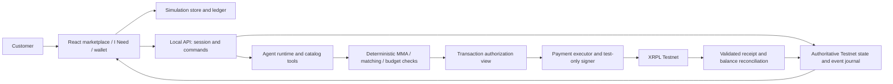

# Yardle submission-completion implementation plan

Date: 2026-09-05. Status: ready for implementation after review of the completed simulator. This replaces the previous automatic-simulation-only plan. It is a handoff, not a claim that the following integrations already exist.

## 1. Outcome and requirement authority

Deliver one reproducible customer journey with an actual AI-agent task, human-authorized execution, and a successful validated XRPL Testnet payment, with a visible receipt, wallet update, architecture diagram, and submission evidence. Preserve the existing simulator as an explicitly labeled rehearsal experience.

The user's latest submission checklist and the current official challenge README distinguish required XRPL/agentic flow from recommended Starter Kit and x402/MPP usage. The official README confirms this distinction. CHALLENGE.md remains read-only; record newer clarifications in CONTEXT.md rather than changing historical requirements.

This iteration adds a transaction authorization view inside the existing application. It does not restore manual listing moderation or a separate admin deployment. MMA approval/rejection and matching remain automatic. The payer authorizes a specific prepared payment; the agent then executes the authorized action through guarded tools. Describe this as human-authorized agent execution.

Scope decision for the minimum real path: use a direct native-XRP Testnet Payment. Do not call this escrow. Keep simulated escrow/release/refund as a separate rehearsal mode. Real escrow is a later enhancement, not a prerequisite for the newer minimum transaction checklist.

## 2. Reviewed baseline: preserve and repair

Independent verification: npm.cmd test passed all 25 tests; npm.cmd run build passed TypeScript and Vite. Four additional temporary review probes confirmed the gaps below and were removed afterward. A real browser walkthrough has not been performed; passing domain tests does not establish visual/accessibility completion.

Keep:

- Fifteen-product seeded catalog, latest-ten-sales MMA, condition adjustment, and inclusive 70-130% policy for asking prices and buyer ceilings.
- Integer-cent simulated money, exact product/condition matching, 90-day intent timestamps, oldest-expiring allocation, single-unit inventory.
- Marketplace, Cart, I Need, Sell, Activity, Wallet, Notifications, persona switching, and reset.
- Ledger-derived simulated balances and existing lifecycle tests.

Fix before connecting signing:

| Finding | Current evidence | Required repair |
| --- | --- | --- |
| Commands do not enforce actor ownership | A nonexistent seller can publish; the current seller can submit as a buyer and confirm their receipt through reducer commands. | Validate actor and entity ownership for every mutation. Seed builders/tests must pass explicit fixture actors, not rely on bypasses. A user may buy and sell, but may only operate their own entities. |
| Payment integration boundary is incomplete | runMatching calls synchronous fund; confirmReceipt/cancelOrder write ledger entries without calling provider release/refund. | Keep pure state transitions and move side effects to an async service. Do not let receipt/cancel invent successful network outcomes. |
| Saved-state validation is shallow | Empty personas passes compatibility then breaks the UI; a null intent throws during expiry processing. | Validate nested shapes, IDs, money, timestamps, relationships, and current persona; return recovery state without crashing. Surface persistence failures. |
| Persistence/UI validation is incomplete | DEBUG.md leaves browser and store tests outstanding. | Add store tests and actual browser checks, including narrow layout and keyboard dialogs. |
| README and some copy are stale | README still asks sellers for MMA and mentions seller-operated funding; cart text promises automatic XRPL escrow. | Rewrite instructions and mode-aware labels to match the final behavior. |
| Existing tests have limited scope | Receipt isolation test uses one order; several ownership/persistence cases are absent. | Add two-order isolation, negative actor, corruption, and replay cases. |

Do not roll back the domain/UI refactor. Do not broaden the product-price policy in this iteration; the buyer-ceiling tradeoff is documented in EVALUATION.md.

## 3. Execution modes and currency contract

Expose two clear modes through demo controls, fixed for each request/order:

1. **Simulation:** current Demo SGD catalog and simulated escrow. Add the same authorization screen so it can rehearse the real workflow, but make outcomes unmistakably simulated.
2. **XRPL Testnet:** agent-assisted purchase, authorization, direct XRP payment, and confirmed receipt. No simulated fund/release/refund ledger entries may be posted for these orders.

Avoid a detached token transfer presented as full settlement. For the main phone fixture define a separate, explicit test-price schedule:

- Good-condition reference MMA: 4 test XRP.
- Accepted asking range: 2.8-5.2 test XRP.
- Seller asks 3.5 test XRP; buyer permits up to 3.8 test XRP.
- Test-only sale fixtures may be generated by multiplying existing sample cents by 100 to obtain drops (40000 -> 4000000 drops). This is a deterministic fixture denomination, not an SGD/XRP exchange rate or actual phone valuation.
- Show test-XRP prices in every Testnet listing, form, authorization, wallet, and receipt. Never label these as SGD or convert real-world money implicitly.

Introduce tagged money/valuation types: currency + integer minor amount, with XRP persisted as decimal-string drops or an equivalently validated integer representation. Do not pass XRP through formatMoney/amountCents unchanged. Keep calculations exact and apply condition/range rounding in the relevant minor unit. Scope real execution initially to the main supported phone and configured buyer/seller accounts; other unsupported Testnet items must be disabled clearly.

Mode switches never convert existing orders, release reservations, or replay commands. Keep independent mode state or explicitly mode-tagged entities and filter every query. Simulation reset does not reset real balances or remove the only transaction evidence.

## 4. Minimal architecture

Reuse React/Vite and the pure domain modules. Add a small local TypeScript Node service for model credentials, test signing, authoritative Testnet state, and persistent receipts. No Python environment, separate admin app, production login system, PostgreSQL, Redis, or deployment is required for this demo.



Suggested additions (equivalent organization is acceptable):

```text
server/index.ts
server/session.ts
server/store.ts
server/agent/runtime.ts
server/agent/tools.ts
server/payments/executor.ts
server/payments/xrplProvider.ts
server/payments/reconcile.ts
src/domain/authorization.ts
src/domain/paymentTypes.ts
src/pages/Authorization.tsx
src/pages/AgentRequest.tsx
src/pages/RunDetail.tsx
src/api/client.ts
scripts/setup-testnet.ts
scripts/export-evidence.ts
```

In Testnet mode the browser is a view/command client, not the source of truth. Recompute catalog valuation, matching, recipient, amount, and ownership server-side. Never trust a posted localStorage snapshot. Use one server-owned store for all Testnet orders/reservations/operations. For this one-process demo, validated JSON persistence with serialized writes and atomic file replacement is sufficient; maintain durable operation records before submitting. A small SQLite store is also acceptable if already available.

Bind the local service to loopback, use Vite's same-origin API proxy, reject unexpected origins, and require a local demo session for mutations. A deliberate persona switch may change the session's selected demo actor; it is a test-harness convenience, not production authentication. The server must still check entity ownership and actor-to-test-wallet mapping. Never allow arbitrary request-supplied account seeds or destinations.

The frontend may poll order/run status; WebSockets and multi-device support are not necessary. Keep network side effects outside the reducer.

## 5. Setup and dependencies

- Preserve the existing npm lockfile; add only the runtime/model/schema-validation/browser-testing dependencies actually chosen.
- Provide documented commands for frontend and server, a combined development command if useful, and separate offline tests versus live integration rehearsal.
- Use one actual tool-capable model provider available to the team. At implementation start, identify the provider/model and record its exact SDK and configuration. Credentials must be supplied through local server environment, never invented or printed. If unavailable, continue all independent work and report the live-agent test as blocked; a stub may support tests but cannot satisfy the demo gate.
- Provide .env.example with placeholders for model provider/model/API key, Testnet endpoint, buyer/seller test wallet configuration, and server port. Ignore .env and private runtime data; never use VITE_ variables for secrets.
- Supply an explicit setup-testnet script that creates/funds fresh test-only accounts as needed and stores secrets locally. Do not fund accounts on every startup or reset. Output only public account addresses and readiness results.
- Validate a Testnet-only endpoint allowlist and signer/account mapping at startup; do not permit accidental Mainnet operation through an environment change. Preflight actual balance/reserve/fee headroom for the 3.5-XRP scenario.
- Health endpoint reports model/network/account readiness without secrets. Missing credentials should produce an actionable setup message, not a fake successful run.

## 6. Agent behavior and value

Add natural-language entry to I Need while retaining the manual catalog path. Main request: `Find an iPhone 13 in good condition, up to 3.8 test XRP.`

The actual agent must:

1. Interpret the item/condition/budget from the request. Missing/ambiguous model, condition, currency, or budget requires clarification before payment preparation.
2. Use constrained tools to look up catalog products, valuation, and eligible listings. Compare candidates when available and identify a suitable listing. Preserve the deterministic fairness allocator: the model cannot jump another buyer's queue.
3. Produce structured intent/selection and a concise explanation referencing actual tool results. It cannot invent a product, raise the ceiling, change the allowed range, or select an arbitrary wallet.
4. Prepare one payment proposal through a guarded tool. The proposal is stored as awaiting authorization; preparation itself cannot sign or submit.
5. After explicit payer authorization, resume execution using the immutable authorized operation ID. The model has no access to raw signing tools; any request to execute must pass the deterministic gate again.
6. Return the confirmed outcome or an honest failure/clarification. A post-hoc generated explanation for a wholly hard-coded flow is not the target agent demonstration.

Bound tool count, model timeout, retries, and input size; validate structured arguments. Treat product descriptions/model outputs as untrusted data. Store sanitized observed events (tool name, safe arguments/result, rule decision, timestamps), not hidden reasoning. No credentials or signing payload secrets enter model context.

Acceptance: paraphrases identify the correct item; unsupported/ambiguous requests cannot pay; injected requests to ignore policy or change destination are refused by code; a valid live invocation yields tool evidence linked to the authorized transaction. Offline fixtures must be visibly distinguished from live model runs.

## 7. Transaction authorization and reservations

Add one same-tab `Authorize payment` view linked from buyer Activity and agent results. This fulfills the earlier admin-interface purpose without introducing seller/listing moderation.

Show: request/run/order IDs, product and condition, MMA/range, asking price, buyer ceiling, payer/payee addresses, network, payment type, expected amount and maximum authorized fee, expiry, and a short explanation. Actions: `Authorize [amount] test XRP` and `Decline`. Simulation uses explicitly simulated wording.

Matching now allocates a candidate and reserves its listing/intent before funding. No money moves when the proposal is created. Use a five-minute authorization window, capped by intent expiry. Approve revalidates ownership, policy, availability, mode, funds including fees/reserves, and the unchanged proposal. Changed price/payee/network/amount requires a new proposal and fresh authorization.

Decline, expiry, and cancellation before submission close the request/proposal, release the reservation, and notify both parties; do not immediately recreate the same rejected request. Other eligible buyers can then match. A pending proposal must prevent duplicate allocation of its listing or intent. Reserve planned spending per payer or otherwise serialize and recheck funds so multiple authorizations cannot overspend.

Use operation IDs and command idempotency keys. Disable in-flight buttons but enforce replay protection server-side. Record authorizing actor and timestamp. Simulation may execute immediately after approval; live execution must wait for actual validation.

## 8. Payment states and reliable execution

Model payment status separately from delivery and simulated escrow:

```text
awaiting_authorization -> authorized -> submitting -> validated
          |                   |             |           |
     declined/expired      cancelled     uncertain     receipt later
                                            |
                                 validated / failed / expired_unsubmitted
```

Names may differ, but semantics must be explicit. Authorized work is not paid; submitted work is not necessarily successful. Once signed/submitted or status is uncertain, do not release inventory or offer an immediate refund until reconciliation establishes the outcome. Serialize cancellation versus submission.

Direct-payment order states: awaiting_payment, payment_pending, paid, fulfilled, cancelled, payment_failed. Successful payment marks the item unavailable and paid; buyer receipt marks fulfilled without moving XRP again. There is no escrow balance or release action for this mode. No unilateral refund button after validated direct payment; return payments/disputes are deferred. Keep the existing simulated escrow lifecycle only in simulation mode.

Execution contract:

- The service builds the XRP Payment from immutable server-side order/account records, adds a minimal order/run reference if using a memo, autofills appropriate transaction fields, and respects explicit fee/amount/network limits.
- Store operation ID, expected accounts/amount, sequence, LastLedgerSequence, signed transaction hash, and authorization before broadcast. Keep any signed blob private; never return secrets to the UI.
- Await validated ledger result and require tesSUCCESS. Verify the resulting transaction matches the intended type, accounts, amount, network, and operation before marking paid. Do not enable partial payments for this demo.
- Persist validated result, ledger index, hash, amount, fee, timestamp, and explorer URL. Refresh buyer/seller balances from the ledger and show last refresh time/stale state if unavailable.
- On timeout/disconnect, persist uncertain status and reconcile the existing hash before creating any replacement. Retrying the same operation cannot sign a second economic payment. Use ledger expiry and adequate ledger history to distinguish not yet found from definitively not applied.
- On process restart, reconcile unfinished operations before accepting new work for their account/reserved inventory. Persist state atomically and serialize per-wallet sequence use.
- Real balance changes include network fees and reserve constraints; do not apply the simulator's fee-free conservation equation. A failed included transaction may still cost a fee. No synthetic wallet success on error.

Official implementation references: [Send XRP](https://xrpl.org/docs/tutorials/payments/send-xrp) and [Reliable Transaction Submission](https://xrpl.org/docs/concepts/transactions/reliable-transaction-submission). Validate behavior against the installed xrpl.js version rather than assuming a synchronous provider swap is sufficient.

## 9. Wallet, evidence, and delivery views

- Add a clearly labeled Testnet wallet panel with public address, XRP balance, refreshed time, pending authorized payments, and actual receipts. Preserve the simulation ledger display separately.
- Add a run-detail page with chronological observed actions: customer request -> catalog lookup -> valuation/matching -> authorization -> submitted -> validated -> order outcome. Every event shares run/order/operation IDs.
- Copyable full transaction hash and working network-specific explorer link are required. Never fabricate hashes or count faucet funding as the commercial transaction.
- Show a paid order receipt and a buyer receipt-confirmation control for the physical handoff demonstration. State that delivery itself is simulated; blockchain payment does not establish item condition or delivery.
- Persist evidence independently of resettable fixtures. Provide export-evidence that writes a sanitized real-run receipt and trace; do not export keys, API tokens, private signed blobs, or model hidden reasoning.
- A cached authentic recording can back up a network outage, labeled `Recorded successful run`; live failures must remain visible. Cached evidence does not authorize another spend.
- Simulation reset restores seeds; Testnet fixture reset is disabled while operations are pending/uncertain and archives historical receipts without claiming to restore funds.

## 10. Existing UI and storage hardening

- Add nested persisted-schema validation and a recovery prompt for invalid personas, null entities, bad money/timestamps, missing order relationships, and unsupported versions. Warn if storage writes fail instead of implying persistence worked.
- Reset or reconcile persona-dependent local page state when persona changes; Activity currently retains its initial buyer/seller tab.
- After Sell/I Need submission, show the created request/listing and outcome or navigate to its activity entry; clearing an input alone is weak feedback.
- Enforce cart selection/ownership and deduplicate lines in the command/API boundary, not just the UI; preserve unselected/rejected lines and detect stale inventory.
- Add modal focus entry/trap/restore and Escape handling; verify nested labels/buttons and keyboard operation. Keep narrow-screen navigation reachable.
- Keep valuation source sample counts accurate if seed history changes; missing evidence cannot yield a usable payment proposal.
- Correct README, footer, consent text, and status labels for the two modes. Automatic price acceptance is not automatic spending without authorization.

## 11. Tests and evidence gates

Update existing tests for the authorization gate; retain coverage of the original price, matching, and accounting rules. Do not rewrite good modules just to increase test count.

### Offline automated tests

- All existing relevant 25 behaviors retained, with matching now reserving before authorized funding.
- Unknown actor/entity, impersonated buyer/seller, wrong-owner edit/receipt/cancel/authorize, invalid mode, and tampered destination/amount fail without effects.
- Both price bounds and exact boundaries in both currencies; budget below asking, self-purchase, expired intent, and missing catalog evidence cannot pay.
- Two competing buyers reserve only one listing; two concurrent approvals cannot overspend or duplicate orders; expired/declined requests cannot loop back into a reservation.
- Two different funded simulated orders prove receipt/refund isolation; repeated release/refund is idempotent; injected provider failure cannot become success.
- Agent structured-output/clarification/tool-policy tests including unsupported product and malicious payment arguments. Test stubs are not live evidence.
- Async executor tests for validated success, definite rejection, fee failure, timeout then later success, timeout with later proven expiry, restart, duplicate approve, and cancellation racing submission. No duplicate economic transaction.
- Nested corrupt-state recovery, persistence failure, refresh, migration/reset, and private receipt retention.

### Browser verification

Add a small browser test suite (Playwright or equivalent) or record an actual manual run when automation is unavailable. Test desktop and narrow viewport, keyboard authorization/dialog use, persona switching, form feedback, decline/no-money-change, successful simulation, refresh/reset, and two-order isolation. Static CSS inspection is not enough to mark responsiveness verified.

### Live completion gates

- A real model invocation with recorded constrained tool use produces the intended request/selection.
- A payer explicitly authorizes one Testnet proposal; actual submission validates successfully with a real hash and explorer link.
- The app displays corresponding actual account balance changes and paid order; one out-of-policy attempt causes no submission.
- Restart/refresh retains and shows that receipt; a recorded run includes the real model action and payment under the same run reference.
- Required setup/test commands are run and their actual output is summarized in DEBUG.md. If credentials, funding, or networking prevent a live gate, identify that precise blocker and leave the gate incomplete; never replace it with mock evidence.

## 12. Submission artifacts and rubric coverage

Create/update:

- README.md: exact setup, commands, server credentials by name only, test-only wallet funding, mode differences, reproducible main script, and tested runtime versions.
- SUBMISSION.md: customer problem, target user, product, agent value, commercial hypothesis, actual architecture diagram, implemented/simulated/future table, integration usage statement, and links to evidence.
- TRANSACTIONS.md: at least one genuine successful commercial-flow hash with network, explorer URL, accounts, amount/fee, final result, ledger/time, and run/order IDs. Do not prefill fictitious values.
- BUILDER_FEEDBACK.md: actual XRPL/model integration issues, reproduction steps, workarounds, and remaining production limitations.
- DEBUG.md: updated acceptance evidence and all remaining gaps, distinguishing automated, browser, and live checks.

Verify challenge feedback hook/skills setup before further integration work and record actual status. Review telemetry destinations/content and existing authorization before enabling any hook that sends feedback externally; do not silently send messages or final forms on the user's behalf. Prepare final feedback content for the user's submission. Do not claim tools were used merely because skills/docs were read.

Starter Kit and x402/MPP are recommended enhancements, not missing mandatory software in this minimum handoff. Explain actual usage or non-use accurately. Consult the official resources and implement a bounded paid-data call only after the core flow works, if it adds value and time permits. No other blockchain or EVM sidechain substitutes for XRPL.

## 13. Implementation order and reviewable milestones

1. Repair ownership/persistence gaps, add schema/money types, and keep baseline tests passing.
2. Split matching from funding; add reservations and the authorization view in simulation. Verify decline, expiry, double-click, and balances.
3. Add the local service, Testnet fixture denomination, test-account setup, durable async payment executor, wallet receipts, and recovery. Rehearse one real authorized payment.
4. Add live model tools and connect one natural-language request to the same authorization/execution path. Record actual trace.
5. Complete browser checks, polish mode-aware copy, and generate real evidence/submission documents.
6. Review optional integration opportunities against remaining time; do not delay mandatory completion for an expanding roadmap.

At each milestone append actual progress/decisions to CONTEXT.md and update DEBUG.md. Keep existing uncommitted work intact; no broad reset, unrelated refactor, or blanket deletion. No full backend marketplace, mobile app, live scraping, reputation, chat, shipment integration, production custody, or real escrow/refunds is required in this iteration.

## 14. Main presentation script

1. In simulation, show the phone's Demo SGD 400 MMA; reject 200 and 550, then publish at 350. Show that policy validation is automatic.
2. Switch explicitly to Testnet fixtures. Show phone MMA 4 test XRP and asking 3.5 test XRP; explain these are illustrative test prices, not an exchange rate.
3. As the mapped buyer, ask the live agent for a good-condition iPhone 13 up to 3.8 test XRP. Show real catalog/selection events and the chosen proposal.
4. Open Transaction authorization. Show exact payer/payee, amount, fee cap, and policy checks. Demonstrate decline on one proposal with unchanged payment state; submit a fresh request for the successful run.
5. Authorize once. Show submitting then validated result, actual transaction hash/explorer, wallet refresh, and paid order.
6. Confirm item receipt to demonstrate physical handoff status only; no second transfer or fake escrow release occurs.
7. Show concise architecture, why the agent helped, actual integration choices, remaining production improvements, and reproducibility/evidence links.

Definition of done: one observed customer request produces genuine agent tool use, explicit authorized execution, and a validated XRPL transaction tied to the same order; the user can inspect/reproduce it; the simulator remains coherent; the demonstrated safeguards pass; and all submission artifacts use actual evidence.

## Sources checked for this revision

- [Official challenge and final-submission requirements](https://github.com/Singhacks-2026/ripple)
- [Official challenge resource catalog](https://github.com/Singhacks-2026/ripple/blob/main/resources.md)
- [Feedback hook instructions](https://github.com/Singhacks-2026/ripple/blob/main/agent-instruction.md)
- [XRPL direct payments](https://xrpl.org/docs/tutorials/payments/send-xrp)
- [Reliable transaction submission](https://xrpl.org/docs/concepts/transactions/reliable-transaction-submission)
